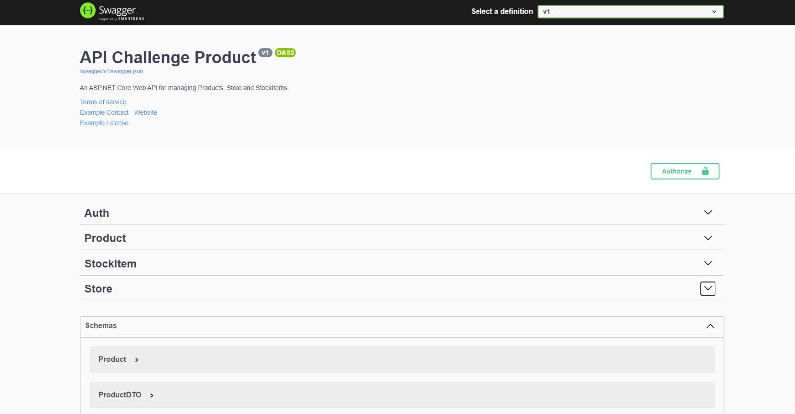
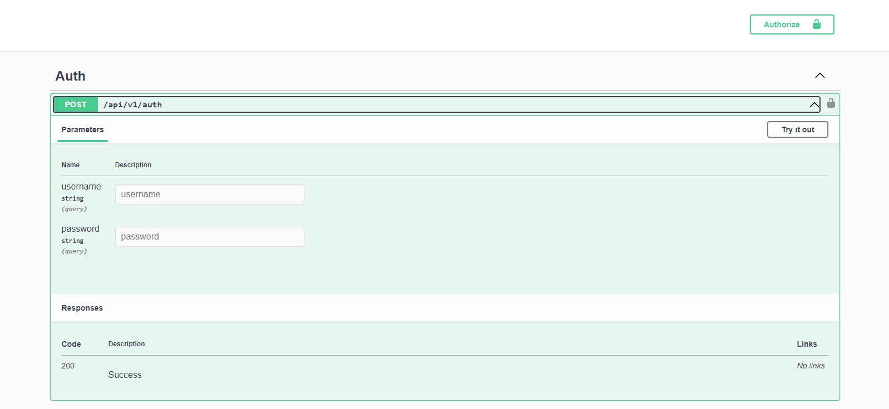
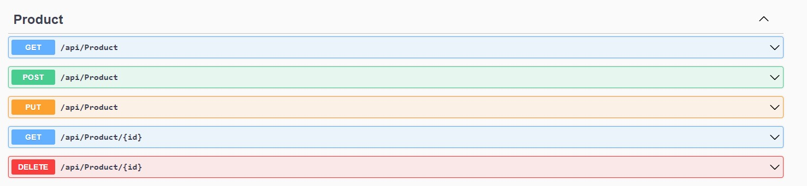
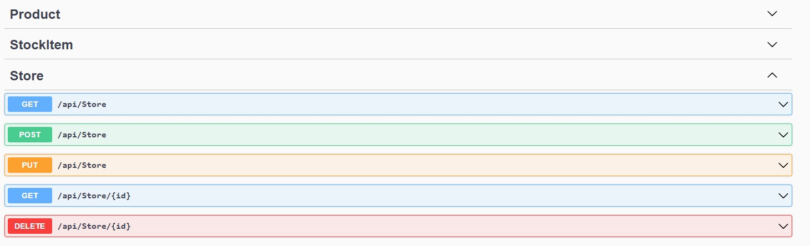
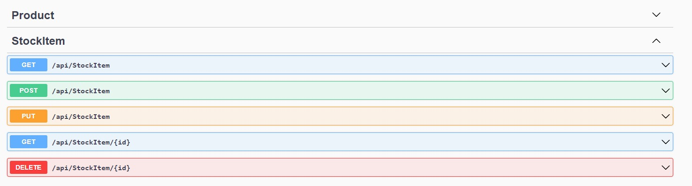
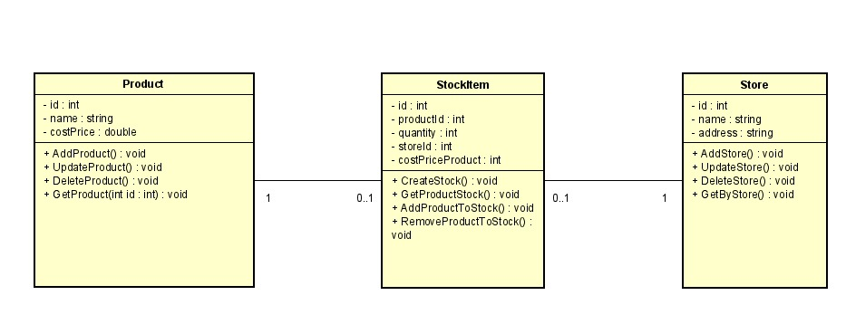

# Products, Stores, and Inventory API 
This project is a .NET 7.0 API for managing products, stores, and the inventory of a specific store. The API provides endpoints for creating, retrieving, updating, and deleting products, stores, and inventory items. Additionally, the API allows adding and removing products from a store's inventory while keeping track of the available quantity.

In this API project I made a small pagination, where users can specify the page number (pageNumber) and the number of items per page (pageQuantity) to retrieve the desired items. Additionally, the project includes authorization using token generation. To obtain the token, users need to provide a username ("admin") and password. This will generate a Bearer JWT token, which is needed to add, modify, and delete data, ensuring secure API access.

## Installation

To install and run this .NET (C#) project, you will need an IDE for .NET development, such as Visual Studio or Visual Studio Code. You will also need MySQL (Workbench) to manage the database. Follow the steps below to set up and run the project:

1. Make sure you have the .NET SDK 7.0 or higher installed on your machine. You can check your SDK version by running the command dotnet --version in the terminal or command prompt.

2. Install MySQL Server on your machine or use a remote server. If you don't have it, download and install the latest version of MySQL Community Server from the official website: https://dev.mysql.com/downloads/mysql/.

3. Create a new MySQL database for the project.

4. Clone the project repository to your machine using the command git clone https://github.com/your-repository-link.

5. Navigate to the cloned project folder using the command cd project-folder-name.

6. Open the appsettings.json file and configure the MySQL database connection string. Replace the values for Server, Database, User Id, and Password with your own database settings.

7. Run the command dotnet ef database update to create the database tables and relationships in MySQL.

8. Run the command dotnet run to start the project's web server.

9. Open a web browser and access the URL http://localhost:5000 to view the project's home page.

That's it! You have successfully installed and set up the project. Now you can explore the functionality and start developing new features using the latest .NET technologies and concepts.

## Project Images

  Application Image
  

The image showcases the application overview using Swagger as the API documentation. Swagger is a powerful tool for documenting and exploring APIs, making it easier to understand and consume the available endpoints in a system.

The image displays a user-friendly and intuitive Swagger interface, presenting a list of different API endpoints. Each endpoint is accompanied by relevant information, such as the associated HTTP method (GET, POST, PUT, DELETE), the endpoint URL, and a brief description of its functionality.

Additionally, the image highlights the required parameters for each endpoint, including the expected input format and available options. This information helps developers and API consumers understand how to interact with each endpoint and what data is necessary to perform desired operations.

Swagger also provides clear and detailed examples of requests and responses, allowing developers to visualize the data they need to send and receive for each API call. This reduces errors and simplifies the integration process with the application.

In summary, the image demonstrates the use of Swagger as an essential tool for API documentation, offering an overview of the application and facilitating understanding and interaction with the various available endpoints.

  Auth Image
  

The authorization process requires the user to enter a username and password (both set as "admin"). Currently, I have implemented a static authorization for learning purposes, as I am still exploring more advanced security measures. With this authentication, the user generates an access token that grants them permission to perform update, delete, and add operations. To generate the token, the user needs to click on the lock icon, and upon authorization, they will receive the necessary token to include in their requests. For example, if the user wants to make a POST request for a specific product, they will need to generate a Bearer JWT token, copy the code, and authorize the request by including the generated token.

  Image of product endpoints
  

1. GET/products: Retrieves a list of all products.
  - Description: This endpoint allows users to retrieve a list of products. However, before making a GET request, the user must generate and authorize an access token. Once authorized, the user can include the desired page number (pageNumber) and the number of items per page (pageQuantity) as query parameters to control the pagination.
  - Example: 'GET/products?pageNumber=1&pageQuantity=10' retrieves the first page of products with 10 items per page.

2. GET/products/{id}: Retrieves a specific product by its ID.
 - Description: This endpoint retrieves a product based on the provided ID.
 - Example: 'GET/products/123'.

3. POST/products: Creates a new product.
 - Description: This endpoint allows creating a new product with the provided data.
 - Example: 'POST/products'.

4. PUT/products/{id}: Updates an existing product by its ID.
 - Description: This endpoint updates an existing product identified by the provided ID with the provided data.
 - Example: 'PUT/products/123'.

5. DELETE/products/{id}: Deletes a product by its ID.
 - Description: This endpoint deletes the product identified by the provided ID.
 - Example: 'DELETE/products/123'

  Image of Store endpoints
  

Image with their respective endpoints, however, some functions and some endpoints still need to be implemented here, which are more specific to add and remove products from the stock based on the store. List endpoints, however, here is for stockItem, not for products

1. GET/stockItems: Retrieve a list of all store.
  - Description: This endpoint allows users to retrieve a list of store. However, before making a GET request, the user must generate and authorize an access token. Once authorized, the user can include the desired page number (pageNumber) and the number of items per page (pageQuantity) as query parameters to control the pagination.
  - Example: 'GET/store?pageNumber=1&pageQuantity=10' retrieves the first page of products with 10 items per page.

2. GET/stockItems/{id}: Retrieves a specific product by its ID.
 - Description: This endpoint retrieves a stock item based on the provided ID.
 - Example: 'GET/store/456'.

3. POST/stockItems: Creates a new product.
 - Description: This endpoint allows creating a new stock item with the provided data.
 - Example: 'POST/store'.

4. PUT/stockItems/{id}: Updates an existing product by its ID.
 - Description: This endpoint updates an existing stock item identified by the provided ID with the provided data.
 - Example: 'PUT/store/456'.

5. DELETE/stockItems/{id}: Deletes a product by its ID.
 - Description:  This endpoint deletes the stock item identified by the provided ID.
 - Example: 'DELETE/store/456'

These are basic CRUD (Create, Read, Update, Delete) operations commonly used in RESTful APIs.

  Image of stockItem endpoints
  

Image with their respective endpoints, list the endpoints, as if it were here, however, here 'and store, instead of product

1. GET/stores: Retrieve a list of all stock items.
  - Description: This endpoint allows users to retrieve a list of stock items. However, before making a GET request, the user must generate and authorize an access token. Once authorized, the user can include the desired page number (pageNumber) and the number of items per page (pageQuantity) as query parameters to control the pagination.
  - Example: 'GET/stockItems?pageNumber=1&pageQuantity=10' retrieves the first page of products with 10 items per page.

2. GET/stores/{id}: Retrieves a specific product by its ID.
 - Description: This endpoint retrieves a store based on the provided ID.
 - Example: 'GET/stockItems/789'.

3. POST/stores: Creates a new product.
 - Description: This endpoint allows creating a new store with the provided data.
 - Example: 'POST/stockItems'.

4. PUT/stores/{id}: Updates an existing product by its ID.
 - Description: This endpoint updates an existing store identified by the provided ID with the provided data.
 - Example: 'PUT/stockItems/789'.

5. DELETE/stores/{id}: Deletes a product by its ID.
 - Description:  This endpoint deletes the store identified by the provided ID.
 - Example: 'DELETE/stockItems/789'

These are basic CRUD (Create, Read, Update, Delete) operations commonly used in RESTful APIs.

  Relationship diagram
  

The diagram illustrates the relationships between three entities: Product, StockItem, and Store. It is a UML diagram representing the associations between these entities.

The relationships depicted in the diagram are as follows:

- Product 1-0..1 StockItem: This relationship signifies that a Product can have zero or one associated StockItem. It implies that a Product may or may not be in stock, and if it is in stock, there will be a corresponding StockItem.

- StockItem 0..1 - 1 Store: This relationship represents that a StockItem belongs to exactly one Store, while a Store can have zero or one associated StockItem. It implies that a Store may or may not have a specific StockItem in its inventory.

## Technologies used:

This project utilizes the following technologies and libraries for developing a .NET 7.0 API for managing products, stores, and product inventory:

- .NET 7.0: The latest version of the .NET framework, providing enhanced features and improved performance.
- Entity Framework Core: An object-relational mapping (ORM) framework for interacting with the database and performing CRUD operations.
- MySQL: A popular relational database management system used for storing and retrieving data.
- AutoMapper: A library for object-to-object mapping, simplifying the process of mapping DTOs (Data Transfer Objects) to entity models and vice versa.
- FluentValidation: A library for validating objects, ensuring the data meets specific criteria.
- JSON Web Token (JWT): A standard for securely transmitting information between parties as a JSON object, used for generating authorization tokens.

By using .NET 7.0, Entity Framework Core, MySQL, and other libraries, this API enables developers to efficiently manage products, stores, and inventory for a given store. It provides endpoints for creating, retrieving, updating, and deleting products, stores, and inventory items. Additionally, pagination has been implemented for retrieving lists of products, stores, and stock items.

To perform delete, put, and post operations on each resource, the user is required to generate an authorization token using JWT. This token ensures that only authorized requests can modify the data.

Throughout the development of this project, I gained valuable experience in working with the latest technologies and concepts in the .NET ecosystem. By leveraging the power of .NET 7.0, I was able to take advantage of its enhanced features and performance improvements. Entity Framework Core facilitated seamless database interactions, and MySQL served as a reliable and scalable storage solution.

Moreover, AutoMapper simplified the mapping process between DTOs and entity models, reducing manual coding efforts. FluentValidation ensured that data passed through the API met the required validation rules, enhancing data integrity and reliability.

This project was an opportunity to expand my knowledge and skills in API development using .NET, and I successfully leveraged the latest technologies and concepts to deliver a robust and efficient solution.
